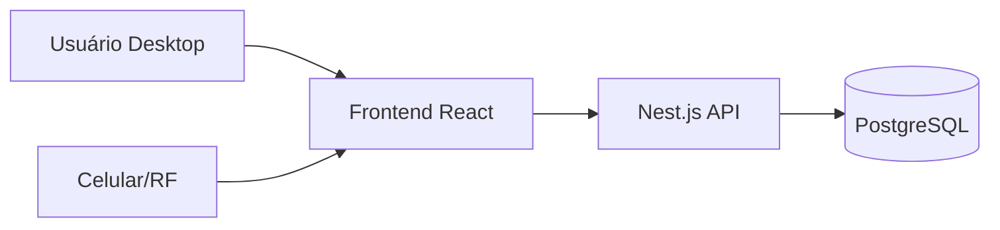

# Arquitetura

Stack
- Frontend: React + Vite (TS recomendado), PWA opcional para uso em celulares.
- Backend: Nest.js (REST), Class-Validator/Transformer, Swagger.
- ORM/DB: Prisma + PostgreSQL.
- Auth: JWT (Bearer), RBAC.
- Infra: VPS com Docker e Nginx (reverse proxy) + TLS (Let's Encrypt).
- Logs e Health: logs estruturados e /health.

Visão de contexto

Componentes
- WEB: Interface desktop e responsiva para uso em celulares. Suporte a câmera para leitura de códigos (Barcode/QR).
- API: Endpoints REST, autenticação/autorização, validações, auditoria de eventos.
- DB: Modelo relacional para produtos, endereços, saldos, tarefas, etc.

Decisões Arquiteturais (ADR)
- Armazenar ADRs em docs/arquitetura/decisoes (template ADR-0001-template.md).
- Padrões de idempotência em operações críticas (ajustes, recebimento, expedição).

Qualidades (NFR)
- Desempenho: consultas indexadas, paginação, cache em memória por módulo (futuro).
- Confiabilidade: transações e locks otimizados; reprocesso em falhas críticas.
- Segurança: OWASP, JWT expiração/refresh, proteção a brute force.
- Observabilidade: logs com correlação (request-id), métricas de health.
